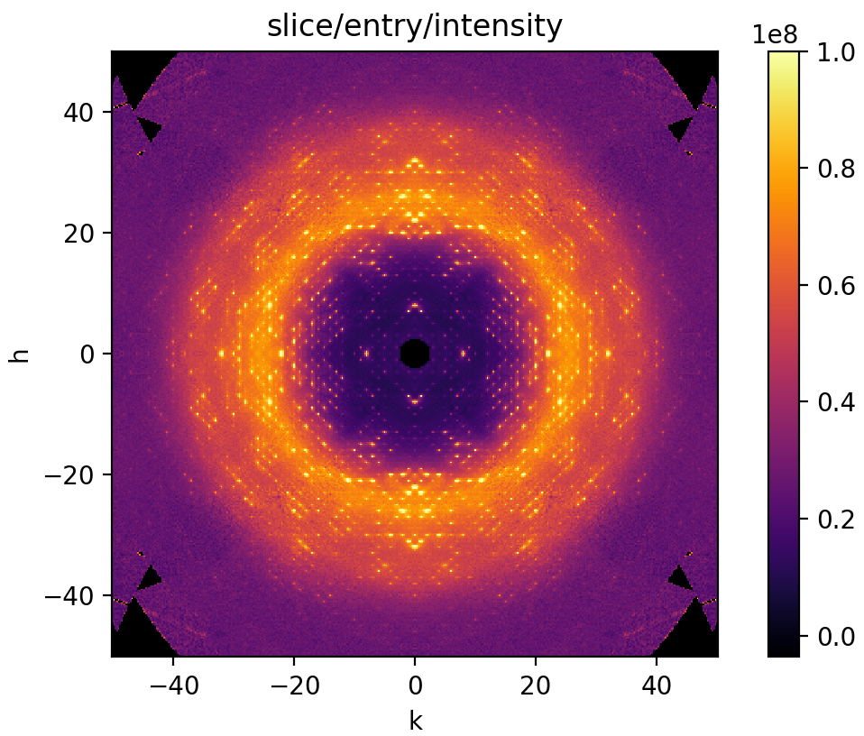

# Data Reduction Workshop for the 2022 Erice International School of Crystallography

These materials were developed for the 2022 Erice School on Diffuse Scattering: https://crystalerice.org/2022/programme_ds.php



## Overview

The workshop is 1.5 hours and is divided into 6 self-guided tutorials.

We will introduce modern diffuse scattering data reduction techniques using three open-source python packages:
- [dials](https://dials.github.io/) for Bragg peak indexing and geometry refinement
- [mdx2](https://github.com/ando-Lab/mdx2) for image processing and reciprocal space reconstruction
- [nexpy](https://nexpy.github.io/nexpy/) for visualization

The tutorials are:

1. [Indexing Bragg diffraction data with *DIALS*](1_dials_indexing.ipynb)
1. [Exploring diffraction geometry using *mdx2* and *nexpy*](2_mdx2_geometry.ipynb)
1. [Processing diffraction images with *mdx2*](3_mdx2_data.ipynb)
1. [Diffuse scattering integration with *mdx2*](4_mdx2_integration.ipynb)
1. [Merging diffuse scattering with *mdx2*](5_mdx2_merging.ipynb)
1. [Using *mdx2* in python (advanced)](6_mdx2_python.ipynb)

## Requirements

The exercises are designed to run on a laptop computer with OSX, Linux, or Windows. You will need at least 10 Gb of free disk space for the python environment, tutorial data, and intermediate files.

If you are bringing your own laptop to Erice, please do the following *before* you travel:

1. Download `insulin_2_1.tar` from Zenodo [doi: 10.5281/zenodo.6536805](https://dx.doi.org/10.5281/zenodo.6536805).
2. Install the Erice-2022 python environment for macromolecular crystallography (Link: https://github.com/cctbx-xfel/erice_2022)
4. Download these tutorials (git clone the repository, or download as a zip file)
3. Follow the *Installation* instructions for *mdx2*, below.

## Installation instructions for *mdx2*

1. Download *mdx2* here: https://github.com/ando-lab/mdx2/archive/refs/tags/v0.3.0-alpha.zip
2. Unzip and move the folder `mdx2-0.3.0-alpha` somewhere easy to find (such as ~/Documents/Erice).
3. Open a terminal window and add the Erice python environment to the path (Instructions here: https://github.com/cctbx-xfel/erice_2022). Change to the `mdx2-0.3.0-alpha` directory, and run:
```bash
pip install -e .
```
This should work without errors (get in touch if you have issues).
4. Verify that `mdx2` is installed by running:
```bash
mdx2.version
```
The current version number should be printed.

## Quick start

1. Double-click `insulin_2_1.tar`. This will produce a folder called `images` with three subdirectories. Move the `images` folder to the tutorial directory (`erice-2022-data-reduction`).
2. Open a terminal window and make sure Erice python environment is on path (see above). Change to the tutorial directory (`erice-2022-data-reduction`) and type:
```bash
jupyter lab
```
Jupyter lab should open in your internet browser.
3. In the File Browser (left panel), double-click `1_dials_indexing.ipynb`.
